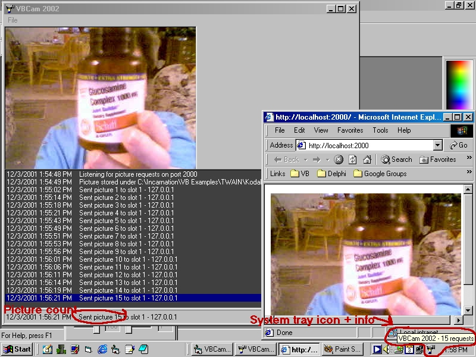



## VBCam 2000

### Description

A VB replacement for the old WebCam 2000 software, which no longer works under Windows 2000. It's a WebCam with a difference - it doesn't take the picture until a request comes in! This is good for lowering the hits on your CPU AND bandwidth, because it doesn't waste its time taking a picture and uploading it every 5 minutes like most WebCams do.

It sits on port 2000, and when a request comes in, it grabs the picture via TWAIN, saves it as a JPG, and sends the picture to the person.
 
### More Info
 

             |
---                |---
**Submitted On**   |2001-12-03 14:02:10
**By**             |[Kamilche](https://github.com/Planet-Source-Code/PSCIndex/blob/master/ByAuthor/kamilche.md)
**Level**          |Beginner
**User Rating**    |5.0 (30 globes from 6 users)
**Compatibility**  |VB 5\.0, VB 6\.0
**Category**       |[Internet/ HTML](https://github.com/Planet-Source-Code/PSCIndex/blob/master/ByCategory/internet-html__1-34.md)
**World**          |[Visual Basic](https://github.com/Planet-Source-Code/PSCIndex/blob/master/ByWorld/visual-basic.md)
**Archive File**   |[VBCam\_2000392131232001\.zip](https://github.com/Planet-Source-Code/kamilche-vbcam-2000__1-29447/archive/master.zip)

